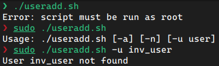
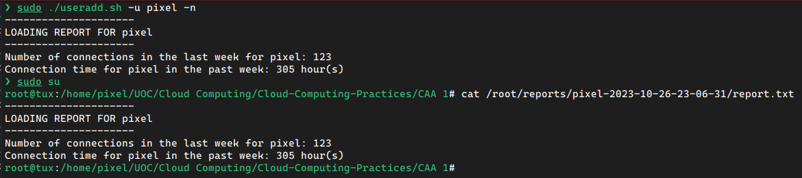

# CAT 1
Alejandro Pérez Bueno
Oct 26, 2023

- [Exercise 1](#exercise-1)



## Exercise 1

### a) awk

``` bash
awk -F: '!($3 < 512 && $4 < 30)' /etc/passwd
```

The `awk` command is a pattern scanning and processing language. In this
case, the command reads the specified file `/etc/passwd` and prints all
the lines that match the criteria. Using the `-F` we specify that the
separator will be a colon `:`, and thus we read several variables
separated by colons in the file. We then apply the criteria
`!($3 < 512 && $4 < 30)`, which is a logical operator that returns false
when the third variable is less than `512` and the fourth is less than
`30`. These variables represent the User ID (*UID*) and the Group ID
(*GID*).

### b) date

``` bash
echo 'date +%T' > /tmp/mydate; chmod +rxs /tmp/mydate; /tmp/mydate
```

This command writes with `echo` a command to display the current time of
day into a file called `mydate` stored in the `/tmp` directory. This
file is then modified with `chmod` to allow **r**eading, e**x**ecuting,
and **s**etting the current user as the user this file will run as. Then
the command is ran by specifying the full path to the executable file.

### c) top

1.  The top 10 processes that are consuming the bigger quantity of CPU.

``` bash
top -b -o %CPU -n 1 | grep --color=no "PID USER" -A 10
```

2.  The top 10 processes that are consuming the bigger quantity of
    memory.

``` bash
top -b -o %MEM -n 1 | grep --color=no "PID USER" -A 10
```

> [!NOTE]
>
> - `-b`: runs `top` in batch mode, preventing any input to the command.
>   Useful to run in a script (as is the case for the creation of this
>   document).
> - `-o %CPU`/`-o %MEM`: Sorts processes by highest CPU/Memory usage.
> - `-n 1`: Run one iteration, instead of the default continuous output.
> - `grep --color=no "PID USER"`: filter results that match the text
>   “PID USER” without coloring the matching text in the output.
> - `-A 10`: retrieve the next 10 lines after the matching output. In
>   this case the text we match is the header of the table displayed in
>   the `top` command.

### d) Sorted files

``` bash
sudo find /usr -type f -printf '%s %p\n' | sort -nr \
| head -n 24 | awk '{print $2, $1/1024/1024 " MB"}'
```

> [!NOTE]
>
> - `sudo`: required to search everywhere inside `/usr`, since some
>   folders don’t have read permissions for regular users.
> - `find /usr -type f`: finds all **f**iles inside the `/usr`
>   directory, including subdirectories.
> - `-fprintf '%s %p\n'`: prints resulting files in the string format
>   specified, i.e. indicating both the **s**ize and **p**ath of the
>   file found by the `find` command.
> - `sort -nr`: sorts the result **n**umerically (by file size) in
>   **r**everse order (largest to smallest).
> - `head -n 24`: retrieve the top `24` lines from the previous output.
> - `awk '{print $2, $1/1024/1024 "MB"}'`: modifies the previous output
>   printing first the second variable (default variable separator for
>   `awk` is ``), and then the first, converted to MB (from bytes):

### e) Executable files

``` bash
sudo find /usr -type f -executable -print
```

> [!NOTE]
>
> - `sudo`: required to search everywhere inside `/usr`, since some
>   folders don’t have read permissions for regular users.
> - `find /usr -type f`: finds all **f**iles inside the `/usr`
>   directory, including subdirectories.
> - `-executable`: prints all files that are executable.
> - `-print`: show the full path to the executable file.



### f) User management

<details open>
<summary>Code</summary>

``` bash
#!/bin/bash

# Remove the `tux` user if already created (this is a test user,
# so it is okay to delete it)
grep "tux" /etc/passwd 1>/dev/null && sudo userdel tux

# Get the last created user's id
userid=$(tail -1 /etc/passwd | awk -F: '{print $3}')
# Set the next user id as the previous + 1
new_userid=$((userid + 1))
# Get the last created group's id
gid=$(tail -1 /etc/group | awk -F: '{print $4}')
# Set the next group id as the previous + 1
new_gid=$((gid + 1))

# Check that the new userid is less than `2048` and exit if necessary
if [ $new_userid -ge 2048 ]; then
    echo "Error: UID reached 2048" >&2
    exit 1
fi

# Create the `users` group only when it does not exist (with the new group id)
! grep "users" /etc/group 1>/dev/null && groupadd -g $new_gid users
# Create the `tux` user with the new user id, added to the `users`
# group by default
sudo useradd -u $new_userid -g users tux
```

</details>

### g) Report generation

#### Code

``` bash
#!/bin/bash

# Main Function
user_activity() {
  echo "---------------------"
  echo "LOADING REPORT FOR $1"
  echo "---------------------"

  # Checks if option -n is present
  if [ $2 -eq 1 ]; then
    # Lists last connections in the past week, filters the current user,
    # and counts the lines in the output
    echo "Number of connections in the last week for $1: $(last -w \
    | grep "$1" | wc -l)"
    # Does the same as before, but calculates the login time and sums it
    echo "Connection time for $1 in the past week: $(last -w | grep "$1" \
    | awk '{print $(NF)}' | grep -v "+\|-\|in" | tr -d "()" \
    | awk '{sum += $1+$2/60} END {print sum}') hour(s)"
  fi
  # Checks if option -a is present
  if [ $3 -eq 1 ]; then
    # Finds all files for the current user modified in the last day
    sudo find / -user $1 -mtime -1
  fi
}

# Checks that script is run as root
if [[ $(whoami | grep 'root') != "root" ]]; then
  echo "Error: script must be run as root" && exit 1
fi

# Checks that script is run with some arguments
if [[ $# -eq 0 ]]; then
    echo "Usage: $0 [-a] [-n] [-u user]"  
    exit 1
fi

# Lists real users in the system (uid >= 1000 excluding user 'nobody')
users=$(awk -F: '$3 >= 1000 && $1 != "nobody" {print $1}' /etc/passwd)

# Set default value for options
n=0
a=0

# Set options, with -u requiring an argument
while getopts "u:na" opt; do  
    case $opt in  
        u)
          # Set users list to just the one user in the list, and ensure it exists
          users=${OPTARG}
          if ! id "$users" &>/dev/null; then  
            echo "User $users not found" && exit 1
          fi;;
        n)
          n=1;;
        a)
          a=1
    esac
done

# Loop over user list, create report directory (if necessary) and save
# all output to a file (also printed on console output)
for user in $users
do
  report_dir="/root/reports/$user-$(date '+%Y-%m-%d-%H-%M-%S')"
  mkdir -p "$report_dir"
  user_activity $user $n $a 2>&1 | tee -a "$report_dir/report.txt"
done
```



#### Screenshots

<figure>

<figcaption aria-hidden="true">Error Management</figcaption>
</figure>

<figure>

<figcaption aria-hidden="true">-n test and report
verification</figcaption>
</figure>

<figure>

<figcaption aria-hidden="true">-a test</figcaption>
</figure>

> [!WARNING]
>
> This is merely a fragment of the code. The system has modified too
> many files in the past `24` hours to be displayed here.

### h) Package manager

#### i) Installed Packages

``` bash
dpkg --list
```

#### ii) Packages to Update

``` bash
apt update
```

#### iii) Package a command belongs to

``` bash
dpkg -S <cmd>
```

#### iv) Package information

``` bash
apt-cache show <package-name>
```

#### v) Find package and version from keyword

``` bash
apt-cache show <package-name>
```
