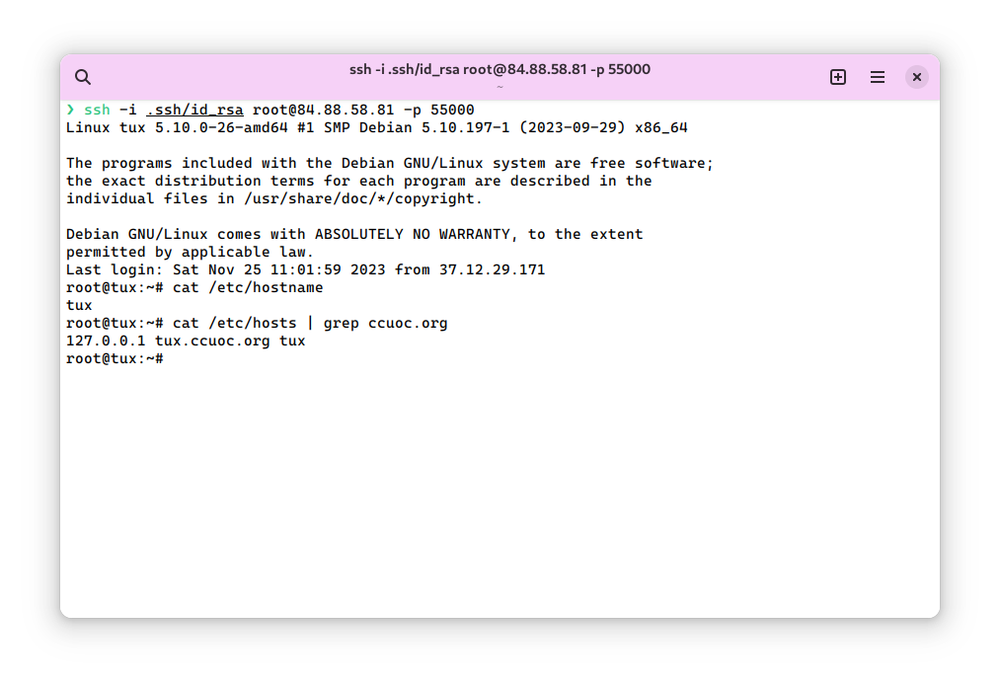
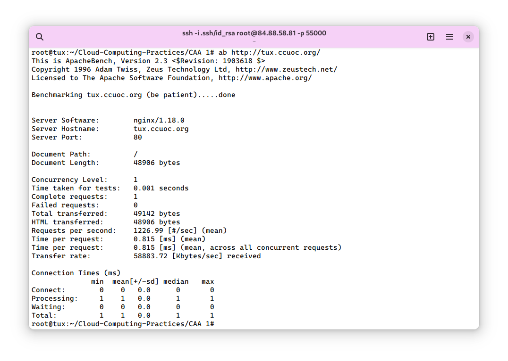
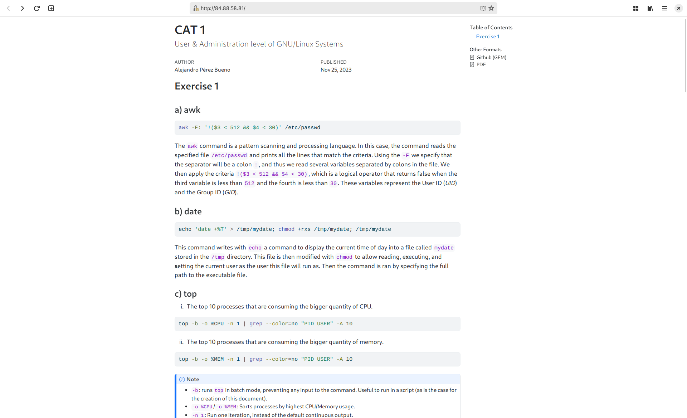
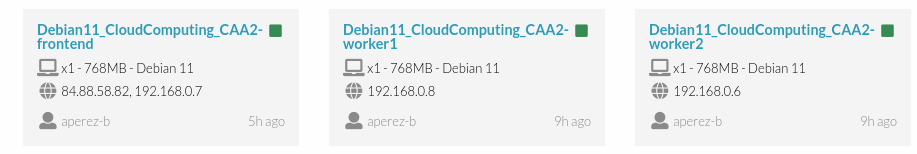
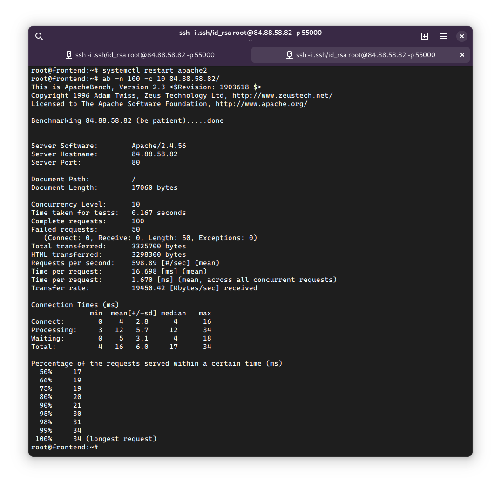
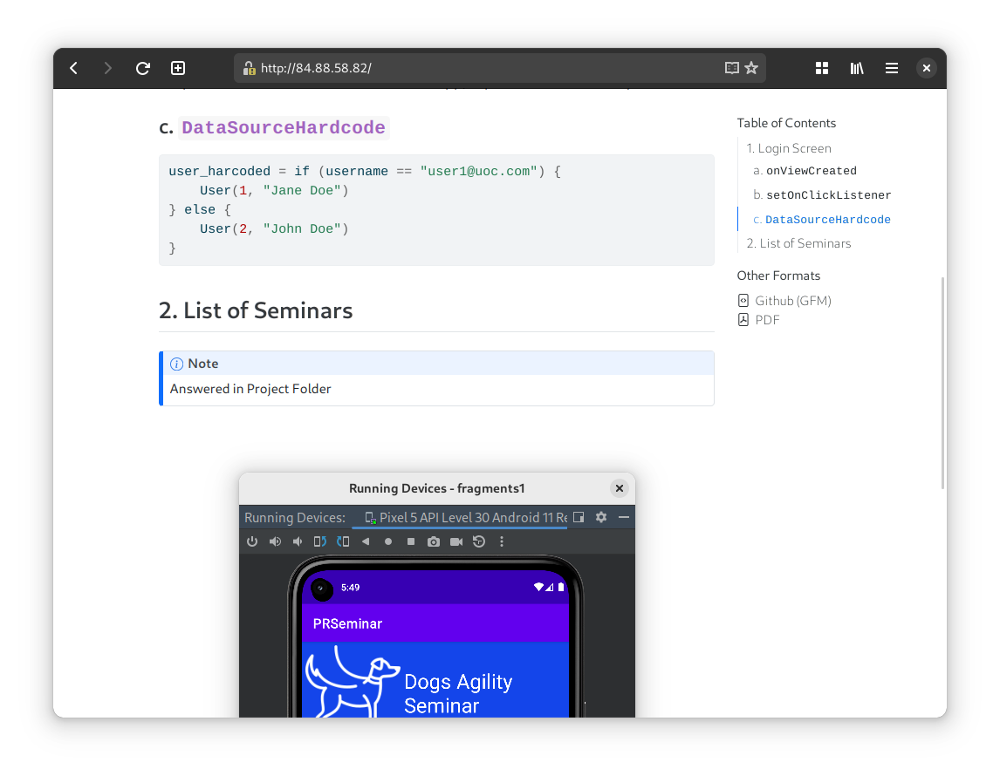

# CAT 2
Alejandro Pérez Bueno
Dec 14, 2023

-   [Exercise 1](#exercise-1)
    -   [Basic VM configuration](#basic-vm-configuration)
    -   [Set up web service](#set-up-web-service)
-   [Exercise 2](#exercise-2)
    -   [Basic VM configuration](#basic-vm-configuration-1)
    -   [Frontend setup](#frontend-setup)
    -   [Workers setup](#workers-setup)
    -   [Testing the results](#testing-the-results)
-   [Exercise 3](#exercise-3)
    -   [Basic VM configuration](#basic-vm-configuration-2)
-   [Annex](#annex)



## Exercise 1

### Basic VM configuration

First and foremost, it is necessary to create the VM and access it with
SSH:

``` bash
ssh -i .ssh/id_rsa root@84.88.58.81 -p 55000
```

In order to configure the VM with minimal configuration, one must do the
following (as *root*):

``` bash
apt update && apt upgrade -y
hostnamectl set-hostname tux
echo "127.0.0.1 tux.ccuoc.org tux" >> /etc/hosts
apt install nginx apache2-utils jmeter -y
```

Line 1  
Update the system.

Line 2  
Set hostname to `tux`.

Line 3  
Change domain to `ccuog.org`.

Line 4  
Install `nginx`, `apache2-utils` and `jmeter`.

Now everything has been set up (see [Figure 1](#fig-minimal-config)).

### Set up web service

The website I created is a web version of the first practice I submitted
(I write them in `quarto`, a markdown tool that does wonders for these
kinds of assignments). It is fairly complex as it has custom images,
code formatting, sidebars and other non-textual content.

First, copy the website and its files to the `/var/www/html` directory:

``` bash
cp README.html /var/www/html/index.html
cp -r README_files/ /var/www/html/
cp -r img /var/www/html/
```

Line 1  
Main *HTML* file.

Line 2  
Extra files from quarto to make the website pretty.

Line 3  
Images from screenshots I made in the previous CAA.

Then start the `nginx` service:

``` bash
systemctl enable --now nginx
```

At this point our website is up and running! We can check that it is
working with `ab` (ApacheBenchmark) and with `JMeter` (see
[Figure 2](#fig-test-ab-jmeter-ex1)).

> **Note**
>
> Note how in the command from [Figure 2 (a)](#fig-test-ab-ex1) I did
> not specify the IP of VM, but the domain. This is merely to prove that
> it is possible to open the website this way too.

You can also simply open a browser on your local machine and enter the
IP of the Remote (see [Figure 3](#fig-website)).



## Exercise 2

### Basic VM configuration

> **Warning**
>
> The VM from the previous exercise has been deleted, so nothing from
> the previous exercise will be reused in this one.

Three VMs have to be configured:

1.  A machine called `frontend` with a private and a public NIC.
2.  A machine called `worker1` with a private NIC.
3.  A machine called `worker2` with a private NIC.

On all of them, we have to do the following:

-   Update packages and install `apache2`.
-   Set hostname and the hosts file appropriately following the same
    scheme as in the prior exercise.
-   Specify the private IPs and domain names for the other VMs in all
    three machines, as follows:

``` bash
192.168.0.7 frontend
192.168.0.8 worker1
192.168.0.6 worker2
```

You can see how I have set up these VMs in OpenNebula (see @on-vms-ex2).

### Frontend setup

Edit the configuration file
`/etc/apache2/sites-available/000-default.conf` adding the following
lines inside the `VirtualHost` section:

``` bash
<Proxy balancer://mycluster>
  BalancerMember http://worker1:80
  BalancerMember http://worker2:80
  ProxySet lbmethod=byrequests # or ProxySet lbmethod=bytraffic
</Proxy>
ProxyPass /balancer-manager !
ProxyPass / balancer://mycluster/
ProxyPassReverse / http://frontend.ccuoc.org/
ProxyPreserveHost On
<Location /balancer-manager>
  SetHandler balancer-manager
</Location>
```

This configuration sets a balancer for the two websites hosted on the
worker VMs with a certain balancer algorithm (installed as a module
using `a2enmod`). It also enables the use of the `balancer-manager`
extension.

### Workers setup

Copy the different websites and their necessary files to each of the
worker VMs’ `/var/www/html` directory. For this I picked the following:

-   For `worker1` VM: Same site from the previous website.
-   For `worker2` VM: Similar site from another project.

### Testing the results

Once all 3 VMs are up and running, let’s make sure that they all three
have the `apache` service started and updated to the latest changes made
in the configuration files. To do so, we will restart the server:

``` bash
systemctl enable apache2
systemctl restart apache2
```

Then, using `ab` like in the previous exercise we can benchmark the two
balancing algorithms we are to compare:

-   `byrequests`: distributes traffic evenly to every worker. In this
    case it would be `50`/`50`.
-   `bytraffic`: distributes the workload based on the load of each
    worker.

We will compare the two algorithms by running the following command:

``` bash
ab -n 100 -c 10 <FrontendPublicIP>/
```

-   `ab`: The same apache utility used in exercise 1.
-   `-n 100`: number of petitions made to the server.
-   `-c 10`: number of *concurrent* requests made to the server at a
    time.

As can be seen in the screenshots from [Figure 4](#fig-lbmethod),
`bytraffic` is more efficient at distributing higher workloads, since
fewer requests are lost when compared to the `byrequests` algorithm.

You can also verify that the balancer located at
`http://<FrontendPublicIP>/balancer-manager` is working (see
[Figure 5](#fig-balancer-manager)), and that both sites are served in
the frontend (see [Figure 6](#fig-pages-ex2)).



## Exercise 3

> **Warning**
>
> For the third exercise, I reused some of the previous configurations.
> Here is what has changed in the setup:
>
> -   Recreated `frontend`, without setting up Proxy (I kept running out
>     of space when installing `docker`).
> -   Reused `worker1`.
> -   Deleted `worker2`.

### Basic VM configuration

Let’s begin by installing `docker` on both VMs. According to the [docker
documentation](https://docs.docker.com/engine/install/debian/), we must
enter the following commands:

``` bash
# Add Docker's official GPG key:
sudo apt-get update
sudo apt-get install ca-certificates curl gnupg
sudo install -m 0755 -d /etc/apt/keyrings
curl -fsSL https://download.docker.com/linux/debian/gpg | \
  sudo gpg --dearmor -o /etc/apt/keyrings/docker.gpg
sudo chmod a+r /etc/apt/keyrings/docker.gpg

# Add the repository to Apt sources:
echo \
  "deb [arch=$(dpkg --print-architecture) \
    signed-by=/etc/apt/keyrings/docker.gpg] https://download.docker.com/linux/debian \
  $(. /etc/os-release && echo "$VERSION_CODENAME") stable" | \
  sudo tee /etc/apt/sources.list.d/docker.list > /dev/null
sudo apt-get update
```

And then install `docker` and other related utilities:

``` bash
sudo apt-get install docker-ce docker-ce-cli containerd.io \
  docker-buildx-plugin docker-compose-plugin
```

To set up a `swarm` in `docker`, you can do the following on the
`frontend` V:

``` bash
docker swarm init --advertise-addr 192.168.0.25
```

This gives you a token that can be used on the `worker` VM as follows:

``` bash
docker swarm join --token <token> 192.168.0.25:2377
```



## Annex



<table>
<colgroup>
<col style="width: 50%" />
<col style="width: 50%" />
</colgroup>
<tbody>
<tr class="odd">
<td style="text-align: center;"><div width="50.0%"
data-layout-align="center">
<p></p>
</div></td>
<td style="text-align: center;"><div width="50.0%"
data-layout-align="center">
<p></p>
</div></td>
</tr>
</tbody>
</table>

Figure 2: Test that the site is running with `ab` and `JMeter`

<table>
<colgroup>
<col style="width: 50%" />
<col style="width: 50%" />
</colgroup>
<tbody>
<tr class="odd">
<td style="text-align: center;"><div width="50.0%"
data-layout-align="center">
<p></p>
</div></td>
<td style="text-align: center;"><div width="50.0%"
data-layout-align="center">
<p></p>
</div></td>
</tr>
</tbody>
</table>

Figure 3: Test that the site is running with a browser



<table>
<colgroup>
<col style="width: 50%" />
<col style="width: 50%" />
</colgroup>
<tbody>
<tr class="odd">
<td style="text-align: center;"><div width="50.0%"
data-layout-align="center">
<p></p>
</div></td>
<td style="text-align: center;"><div width="50.0%"
data-layout-align="center">
<p></p>
</div></td>
</tr>
</tbody>
</table>

Figure 4: Test the command `ab -n 100 -c 10 84.88.58.82` with two
balancing algorithms

<table>
<colgroup>
<col style="width: 50%" />
<col style="width: 50%" />
</colgroup>
<tbody>
<tr class="odd">
<td style="text-align: center;"><div width="50.0%"
data-layout-align="center">
<p></p>
</div></td>
<td style="text-align: center;"><div width="50.0%"
data-layout-align="center">
<p></p>
</div></td>
</tr>
</tbody>
</table>

Figure 5: `balance-manager` page

<table>
<colgroup>
<col style="width: 50%" />
<col style="width: 50%" />
</colgroup>
<tbody>
<tr class="odd">
<td style="text-align: center;"><div width="50.0%"
data-layout-align="center">
<p></p>
</div></td>
<td style="text-align: center;"><div width="50.0%"
data-layout-align="center">
<p></p>
</div></td>
</tr>
</tbody>
</table>

Figure 6: Pages served by each worker balanced from the `frontend`

\`\`\`
