# CAT 3
Alejandro Pérez Bueno
Jan 03, 2024

-   [Exercise 1](#exercise-1)
    -   [Basic VM configuration](#basic-vm-configuration)
    -   [Set up web service](#set-up-web-service)
-   [Exercise 2](#exercise-2)
    -   [Basic VM configuration](#basic-vm-configuration-1)
    -   [Frontend setup](#frontend-setup)
    -   [Workers setup](#workers-setup)
    -   [Testing the results](#testing-the-results)
-   [Exercise 3](#exercise-3)
    -   [AWS VM configuration](#aws-vm-configuration)
    -   [WordPress installation](#wordpress-installation)
    -   [WordPress setup](#wordpress-setup)
    -   [WordPress performance](#wordpress-performance)
-   [Conclusion](#conclusion)
-   [Annexes](#annexes)



## Exercise 1

### Basic VM configuration

First and foremost, it is necessary to create the EC2 instance that will
host our web service, named `caa3-ami-1` with the tag `aperez-b`.

See [Figure 1](#fig-review-create-instance) for more details.

We can then connect to it via ssh from our machine with the private key
we downloaded in the creation screen, as follows:

``` bash
chmod 400 ~/.ssh/keypair-aperez-b.pem
ssh -i ~/.ssh/keypair-aperez-b.pem ec2-user@ec2-3-94-211-15.compute-1.amazonaws.com
```

> **Note**
>
> In order to properly connect to the remote instance, I had to change
> the default routing table to allow connection with the internet.

To configure the VM with minimal configuration, one must do the
following:

``` bash
sudo yum update -y
sudo yum upgrade -y
sudo hostnamectl set-hostname aperez-b-master
sudo yum install httpd -y
sudo systemctl enable --now httpd
```

Lines 1-2  
Update the system.

Line 3  
Set hostname to `aperez-b-master`.

Lines 4-5  
Install and set up `httpd`.

Now everything has been set up.

### Set up web service

> **Note**
>
> I used the HTML equivalent to the submission I worked on for CAA 2

First, copy the website and its files to the `/var/www/html` directory:

``` bash
cp README.html /var/www/html/index.html
cp -r README_files/ /var/www/html/
cp -r img /var/www/html/
```

Line 1  
Main *HTML* file.

Line 2  
Extra files from quarto to make the website pretty.

Line 3  
Images from screenshots I took in the previous CAA.

At this point our website is up and running at
<http://ec2-3-94-211-15.compute-1.amazonaws.com>. We can check that it
is working with `JMeter` (see [Figure 2 (a)](#fig-test-jmeter-ex1)).

You can also simply open a browser on your local machine and enter the
IP of the Remote (see [Figure 2 (b)](#fig-website)).



## Exercise 2

### Basic VM configuration

> **Warning**
>
> The VM from the previous exercise will NOT be reused in this one.

Three VMs have to be configured:

1.  A machine called `frontend` with a private and a public NIC.
2.  A machine called `worker1` with a private NIC.
3.  A machine called `worker2` with a private NIC.

On all of them, we have to do the following:

-   Update packages and install `httpd`.
-   Set hostname following the same scheme as in the prior exercise.
-   Worker VMs will be called `aperez-b-worker1` and `aperez-b-worker2`.

Here is an example of the code ran on `worker1`:

``` bash
sudo hostnamectl set-hostname aperez-b-worker1
sudo yum update -y
sudo yum upgrade -y
sudo yum install httpd -y
sudo systemctl enable --now httpd
```

### Frontend setup

Create the configuration file `/etc/httpd/conf.d/balancer.conf` adding
the following lines:

``` bash
<VirtualHost *:80>
    ServerName ec2-18-210-13-85.compute-1.amazonaws.com
    ProxyPreserveHost On
    <Proxy balancer://mycluster>
        BalancerMember http://172.31.6.227:80
        BalancerMember http://172.31.6.197:80
        ProxySet lbmethod=byrequests # or ProxySet lbmethod=bytraffic
    </Proxy>
    <Location /balancer-manager>
        SetHandler balancer-manager
    </Location>
    ProxyPass /balancer-manager !
    ProxyPass / balancer://mycluster/
    ProxyPassReverse / balancer://mycluster/
</VirtualHost>
```

This configuration sets a balancer for the two websites hosted on the
worker VMs with a certain balancer algorithm and also enables the use of
the `balancer-manager` extension.

### Workers setup

Copy the different websites and their necessary files to each of the
worker VMs’ `/var/www/html` directory. For this I picked the following:

-   For `worker1` VM: Same site from the previous exercise.
-   For `worker2` VM: Similar site from another project.

### Testing the results

Once all 3 VMs are up and running, let’s make sure that they all three
have the `httpd` service started and updated to the latest changes made
in the configuration files. To do so, we will restart the server:

``` bash
systemctl enable httpd
systemctl restart httpd
```

See [Figure 6](#fig-test-jmeter-ex2) to verify that the websites are
served properly from the `frontend`.

Then, using `ab` we can benchmark the two balancing algorithms we are to
compare:

-   `byrequests`: distributes traffic evenly to every worker. In this
    case it would be `50`/`50`.
-   `bytraffic`: distributes the workload based on the load of each
    worker.

We will compare the two algorithms by running the following command:

``` bash
ab -n 100 -c 10 <FrontendPublicIP>/
```

-   `ab`: The same apache utility used in exercise 1.
-   `-n 100`: number of petitions made to the server.
-   `-c 10`: number of *concurrent* requests made to the server at a
    time.

As can be seen in the screenshots from [Figure 3](#fig-lbmethod),
`bytraffic` is more efficient at distributing higher workloads, since
fewer requests are lost when compared to the `byrequests` algorithm.

You can also verify that the balancer located at
`http://<FrontendPublicIP>/balancer-manager` is working (see
[Figure 4](#fig-balancer-manager)), and that both sites are served in
the frontend (see [Figure 5](#fig-pages-ex2)).



## Exercise 3

### AWS VM configuration

For this last part I merely followed the 5-module tutorial from the post
[*Deploy WordPress with Amazon
RDS*](https://aws.amazon.com/getting-started/hands-on/deploy-wordpress-with-amazon-rds/)
carefully to properly install and configure `WordPress`.

See [Figure 7](#fig-aws-ex3) to check the settings of EC2 and RDS after
following the aforementioned tutorial.

### WordPress installation

See [Figure 8](#fig-wordpress-installed-ex3) to see how the WordPress
site looked before and after setting up the database and the Wordpress
app itself.

> **Note**
>
> At first, I could not upload anything to the media section of the
> WordPress app. Turns out I was lacking permissions to write in the
> specific directory. To fix it, I ran the following command from ssh:
>
> ``` bash
> sudo chown -R apache:apache /var/www/html/
> ```

### WordPress setup

After configuring the database and the VM, it is time to log in with a
new WordPress user. In my case I created a new user `aperez-b` with my
`UOC` email address and started adding blog posts to the site. I added a
total of six entries, with various types of content and media. Some have
lists, images, links, quotes, video, audio, and so on (see
[Figure 10](#fig-wordpress-post-overview)).

> **Note**
>
> As it is hard to show the WordPress site with just screenshots, I
> recorded a [short video](./wordpress-sample-ex3.webm) showcasing every
> post (thus proving that it all works as expected)

### WordPress performance

See [Figure 9](#fig-pagespeeds-ex3) to view the result of the test
performed by [PageSpeed Insights](https://pagespeed.web.dev/).

> **Warning**
>
> In [Figure 9](#fig-pagespeeds-ex3), the url appears to be different
> from all other screenshots from this exercise. This is because I had
> to enable the site to be accessed by anyone (at first I had set it up
> so that only my IP could access the website), and as a result a new
> Public IP address was assigned



## Conclusion

In this CAA I have worked with AWS for the first time, and I cannot say
it was a piece of cake. Nevertheless, it was a fun journey.The overall
experience of working with it to deploy applications has been a valuable
learning opportunity. By understanding the technologies for the
deployment of cloud computing infrastructures securely and efficiently,
I was able to deploy a balanced proxy using Apache2 with a front-end and
two workers, as well as a full-fledged WordPress server. Overall, the
experience has provided me with a solid foundation in cloud computing
that I can build upon in future projects.



## Annexes


<table>
<colgroup>
<col style="width: 50%" />
<col style="width: 50%" />
</colgroup>
<tbody>
<tr class="odd">
<td style="text-align: center;"><div width="50.0%"
data-layout-align="center">
<p>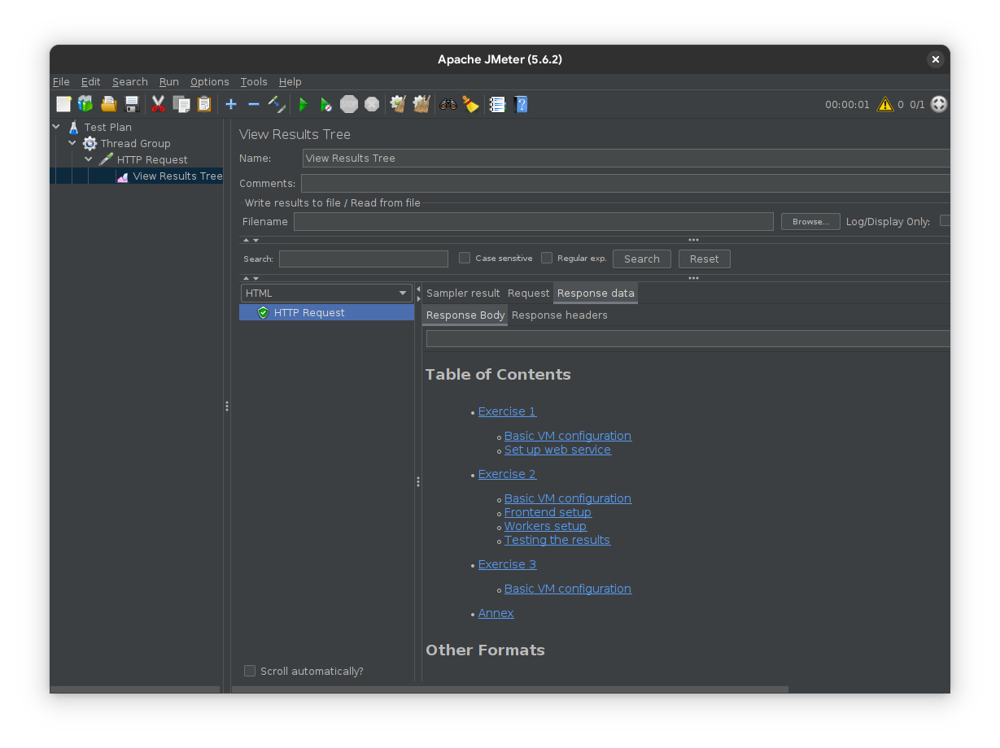</p>
</div></td>
<td style="text-align: center;"><div width="50.0%"
data-layout-align="center">
<p>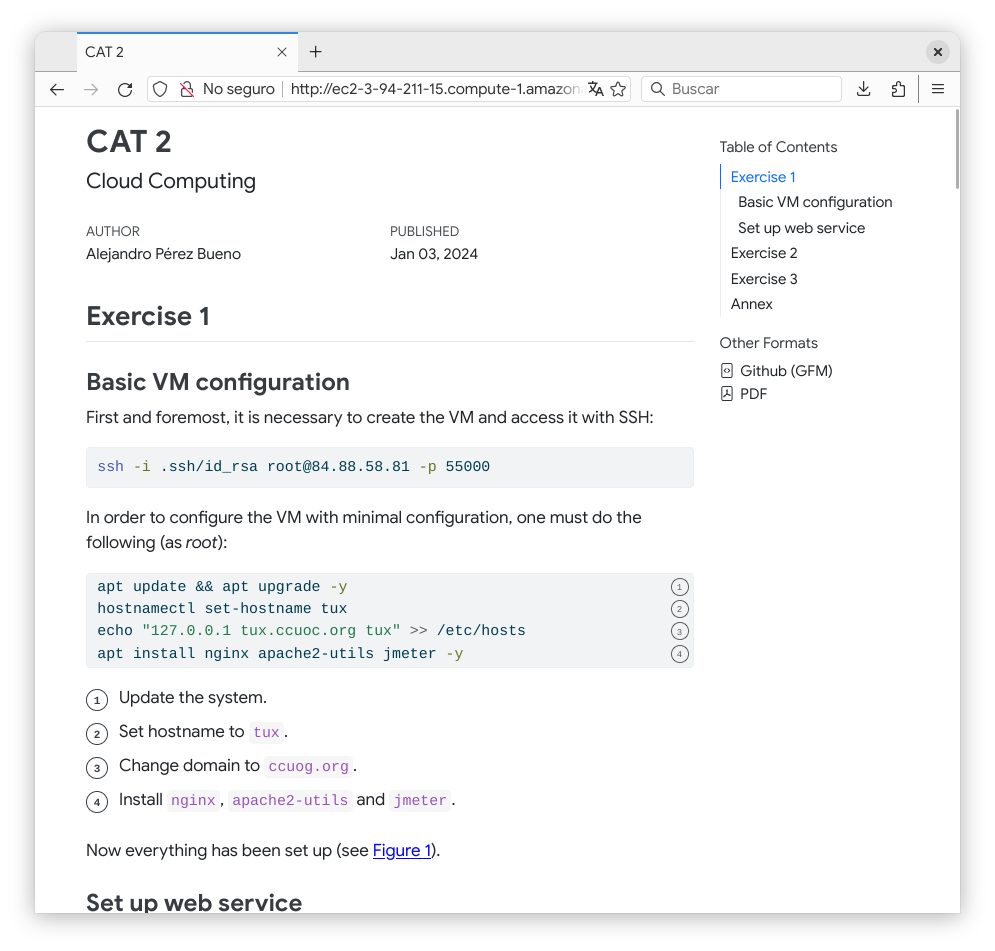</p>
</div></td>
</tr>
</tbody>
</table>

Figure 2: Website running on browser and in JMeter

<table>
<colgroup>
<col style="width: 50%" />
<col style="width: 50%" />
</colgroup>
<tbody>
<tr class="odd">
<td style="text-align: center;"><div width="50.0%"
data-layout-align="center">
<p>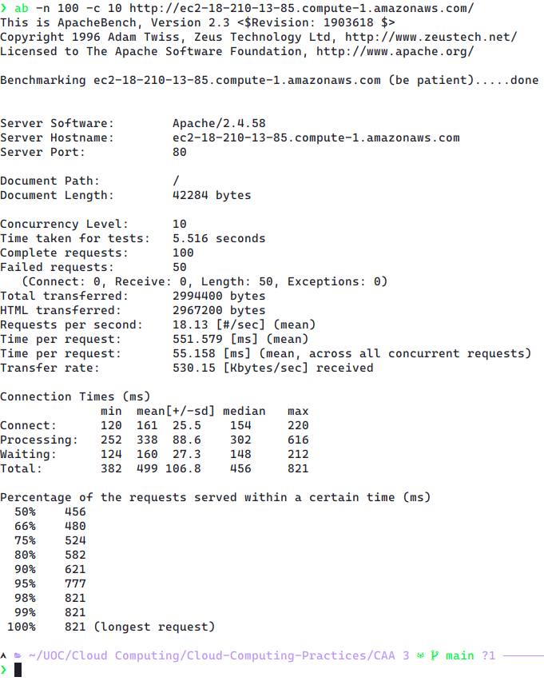</p>
</div></td>
<td style="text-align: center;"><div width="50.0%"
data-layout-align="center">
<p>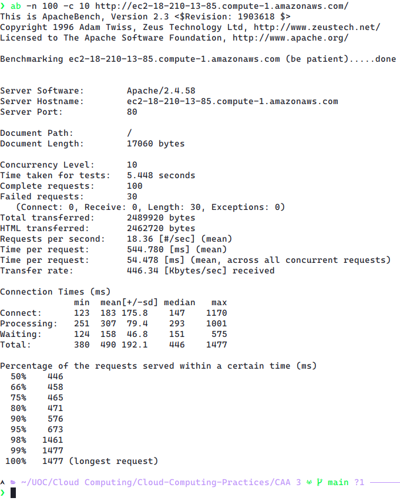</p>
</div></td>
</tr>
</tbody>
</table>

Figure 3: Test the command `ab -n 100 -c 10 <FrontendPublicIP>` with two
balancing algorithms

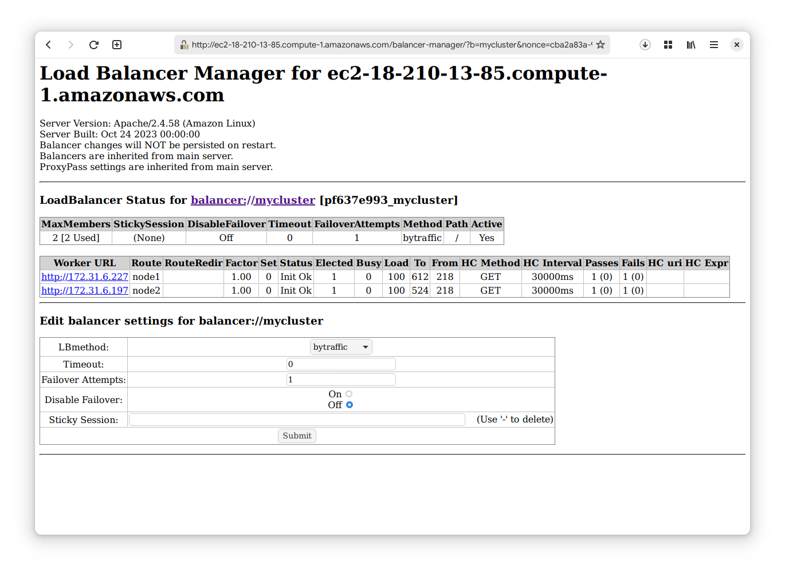

<table>
<colgroup>
<col style="width: 50%" />
<col style="width: 50%" />
</colgroup>
<tbody>
<tr class="odd">
<td style="text-align: center;"><div width="50.0%"
data-layout-align="center">
<p>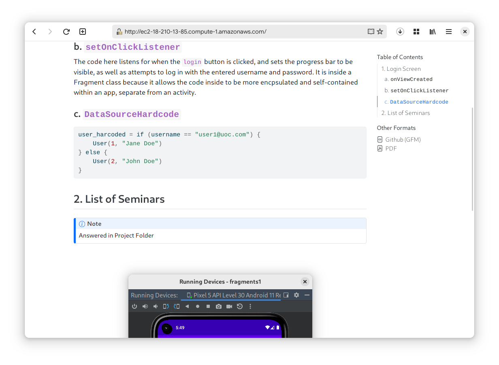</p>
</div></td>
<td style="text-align: center;"><div width="50.0%"
data-layout-align="center">
<p>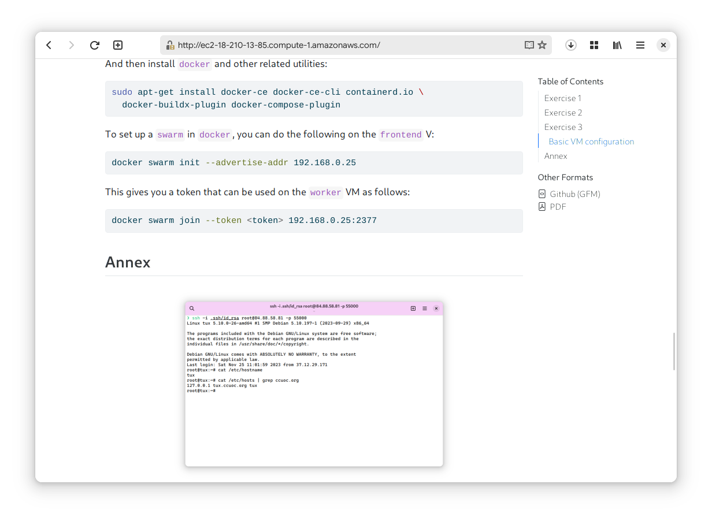</p>
</div></td>
</tr>
</tbody>
</table>

Figure 5: Pages served by each worker balanced from the `frontend`

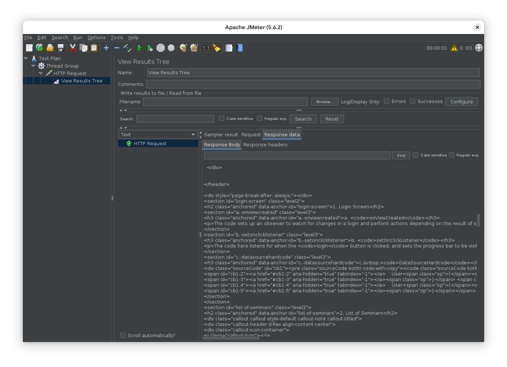

<table>
<colgroup>
<col style="width: 50%" />
<col style="width: 50%" />
</colgroup>
<tbody>
<tr class="odd">
<td style="text-align: center;"><div width="50.0%"
data-layout-align="center">
<p>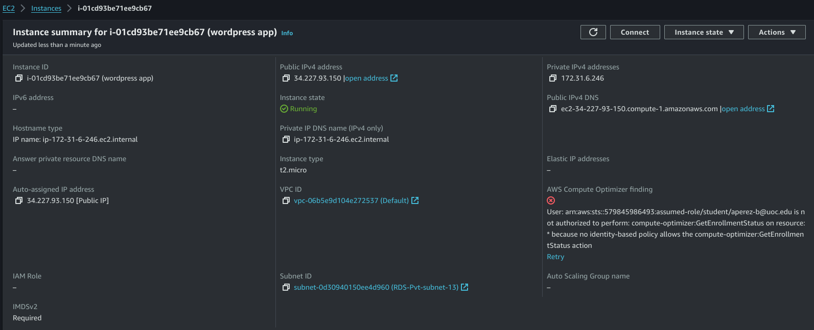</p>
</div></td>
<td style="text-align: center;"><div width="50.0%"
data-layout-align="center">
<p>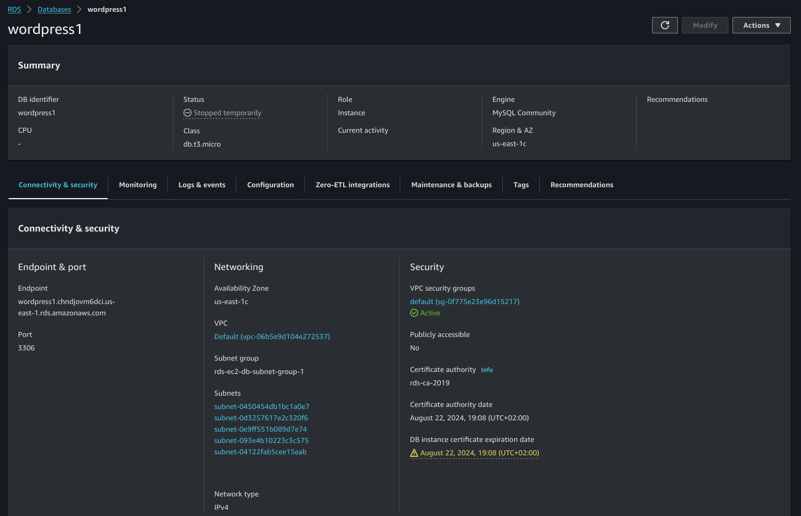</p>
</div></td>
</tr>
</tbody>
</table>

Figure 7: EC2 and RDS configuration

<table>
<colgroup>
<col style="width: 50%" />
<col style="width: 50%" />
</colgroup>
<tbody>
<tr class="odd">
<td style="text-align: center;"><div width="50.0%"
data-layout-align="center">
<p>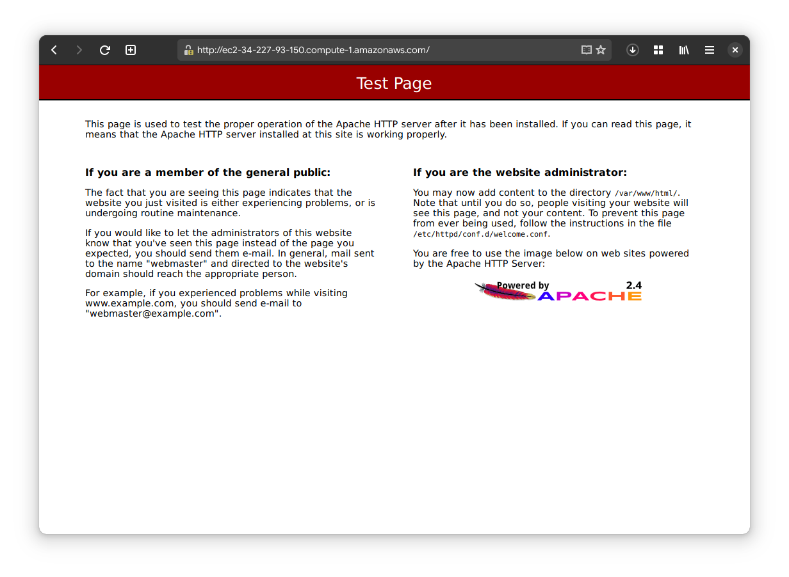</p>
</div></td>
<td style="text-align: center;"><div width="50.0%"
data-layout-align="center">
<p>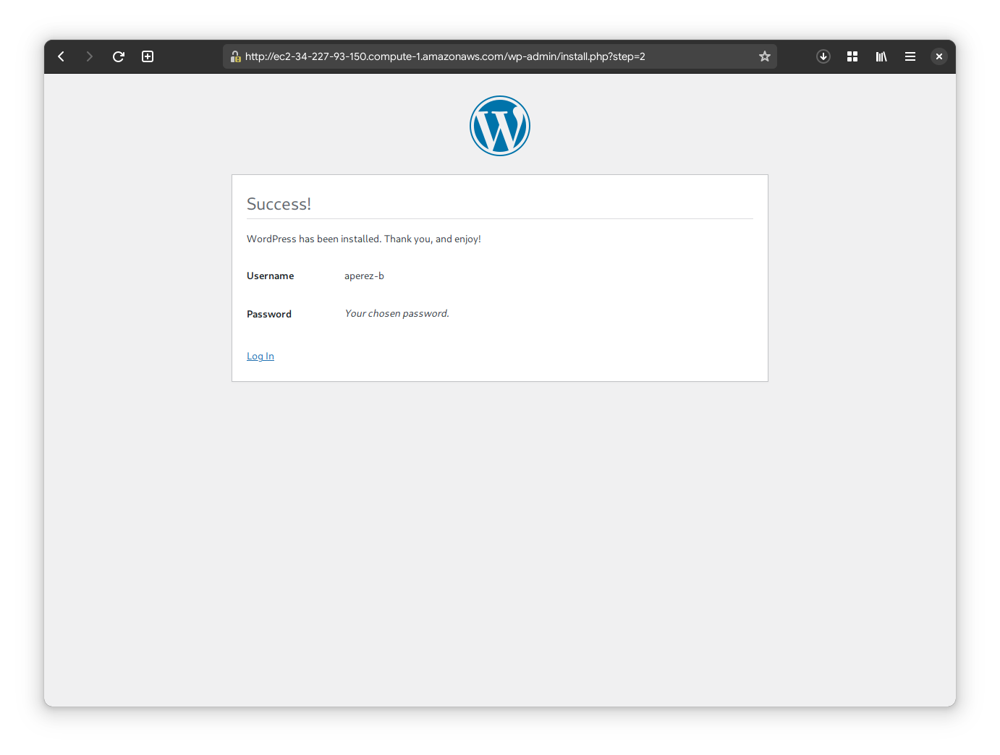</p>
</div></td>
</tr>
</tbody>
</table>

Figure 8: WordPress pre-setup and post-setup

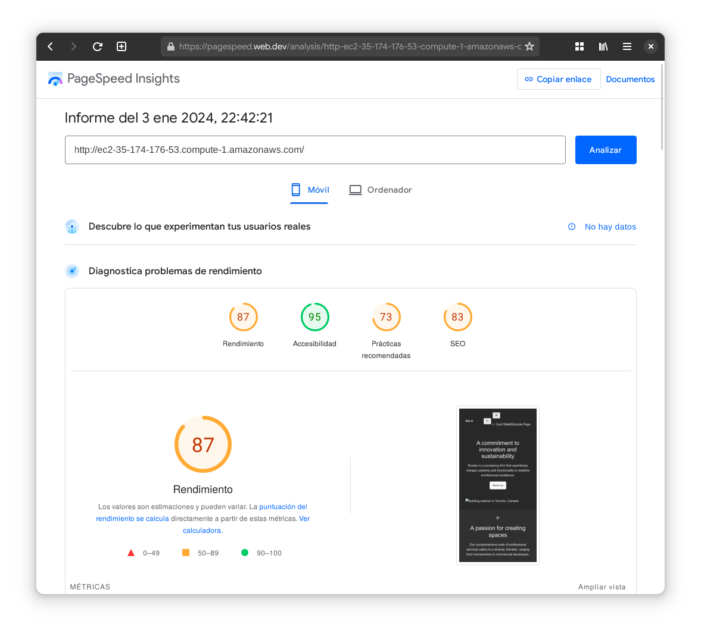

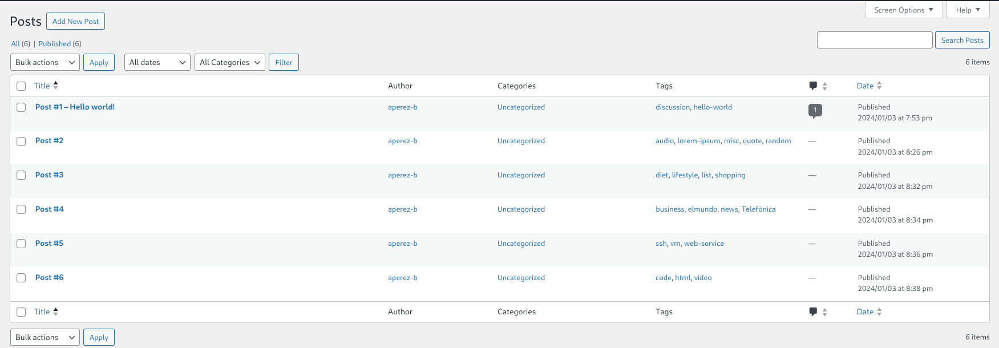
